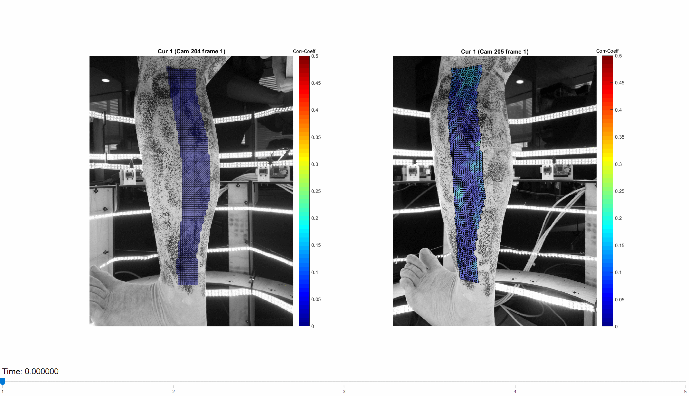
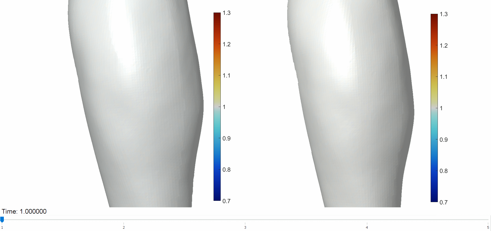

# MultiDIC: a MATLAB Toolbox for Multi-View 3D Digital Image Correlation   

- [Summary](#Summary)  
- [Installation](#Installation)  
- [Getting started](#Start)
- [Citing](#Cite)
- [Contributing](#Contributing)  
- [Application Highlights](#Applications)
- [Publications](#Publications)
- [License](#License)  

## Summary 
This is the official repository associated with the paper: [MultiDIC: an Open-Source Toolbox for Multi-View 3D Digital Image Correlation](https://ieeexplore.ieee.org/document/8371235/) (DOI:[ 10.1109/ACCESS.2018.2843725](https://ieeexplore.ieee.org/document/8371235/)).  
MultiDIC is an open-source MATLAB toolbox by [Dana Solav](https://www.media.mit.edu/people/danask/). Three-dimensional (stereo) Digital Image Correlation (3D-DIC) is an important technique for measuring the mechanical behavior of materials. MultiDIC was developed to allow fast calibration and data merging even for a large number of cameras, and to be easily adaptable to different experimental requirements. MultiDIC integrates the 2D-DIC subset-based software [Ncorr](https://www.github.com/justinblaber/ncorr_2D_matlab) with several camera calibration algorithms to reconstruct 3D surfaces from multiple stereo image pairs. Moreover, it contains algorithms for merging multiple surfaces, and for computing and visualizing 3D displacement, deformation and strain measures. High-level scripts allow users to perform 3D-DIC analyses with minimal interaction with MATLAB syntax, while proficient MATLAB users can also use stand-alone functions and data-structures to write custom scripts for specific experimental requirements. Comprehensive documentation, [instruction manual](https://github.com/MultiDIC/MultiDIC/blob/master/docs/pdf/MultiDIC_InstructionManual.pdf), and [sample data](https://github.com/MultiDIC/MultiDIC/tree/master/sample_data) are included.  
Check out this [short video](https://www.youtube.com/watch?v=DC9ifDJ7lvo&t) for a quick demonstration of MultiDIC's capabilities:  

## Installation   
### System Requirements
MultiDIC was developed and tested on 64-bit Windows 10 and has not yet been tested on other platforms.        
#### MATLAB
MultiDIC was developed on MATLAB versions R2017a and R2017b, and has not yet been tested on prior versions.  

MATLAB toolbox dependencies:
* Image Processing Toolbox
* Computer Vision System Toolbox
* Statistics and Machine Learning Toolbox

### Installation Instructions
To install MultiDIC simply follow these two steps:
#### 1. Get a copy of MultiDIC
Use **one** of these two options:      
**a.** Download and unzip the latest [zip file](https://github.com/MultiDIC/MultiDIC/archive/master.zip).   
**b.** Clone MultiDIC using: `git clone https://github.com/MultiDIC/MultiDIC/.git`.

#### 2. Install (or add to path)    
Use **one** of these two options:          
**a.** In MATLAB, navigate to the unzipped MultiDIC folder, type `installMultiDIC` in the command window, and hit Enter.   
**b.** In MATLAB, Add the MultiDIC folder (with subfolders) to the path and save the path definitions.

## Getting started 
Check out the [instruction manual](https://github.com/MultiDIC/MultiDIC/blob/master/docs/pdf/MultiDIC_InstructionManual.pdf). It should have all the information you need to get started.

## Citing    
This is the official repository for:

[MultiDIC: an Open-Source Toolbox for Multi-View 3D Digital Image Correlation](https://ieeexplore.ieee.org/document/8371235/)   
Dana Solav, Kevin M. Moerman, Aaron M. Jaeger, Katia Genovese, Hugh M. Herr   
DOI: [10.1109/ACCESS.2018.2843725](https://ieeexplore.ieee.org/document/8371235/)

Please cite this paper if you use the toolbox.

## Contributing    
If you wish to contribute code/algorithms to this project, or to propose a collaboration study, please send an email to danask (at) mit (dot) edu.

## Application Highlights 
### These are some examples of figures obtained using MultiDIC:
#### Shape change and skin deformation induced by joint movement and muscle contraction
     
       

#### Shape change and skin deformation induced by indentation    

## Publications 
### Studies who have used MultiDIC:
1. [MultiDIC: An Open-Source Toolbox for Multi-View 3D Digital Image Correlation](https://ieeexplore.ieee.org/abstract/document/8371235)
2. [A framework for measuring the time-varying shape and full-field deformation of residual limbs using 3D digital image correlation](https://ieeexplore.ieee.org/document/8625546)

## License 
MultiDIC is provided under the [Apache-2.0 license](https://www.apache.org/licenses/). The [license file](https://www.github.com/MultiDIC/MultiDIC/blob/master/LICENSE) is found on the GitHub repository.
